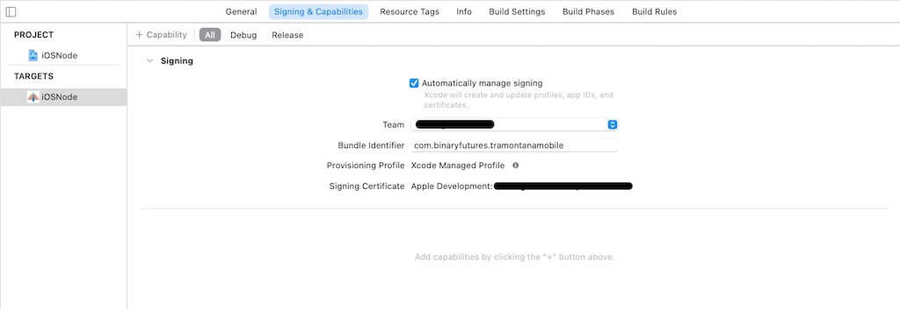

## Tramontana iOS app Repo

### What is Tramontana?

###### A platform for interactive spaces, interactive objects and prototyping.

With libraries for Processing, Javascript and OpenFrameworks you can access the inputs and outputs of one or more smartphones (or other devices) to easily and quickly prototype interactive spaces, connected products or whatever you can think of. What used to involve complex tasks like networking, native app development, etc. can now be created with a single sketch on your computer.

You can find the download links, references and getting started informations on the [Tramontana website](https://tramontana.xyz).

### Introduction and Links

This is the repo page for the Tramontana app for iOS. If you are looking just to use the app you can download it from the app store at [this link](https://apps.apple.com/us/app/id1121069555) or follow the [getting started page](https://tramontana.xyz) on Tramontana website.


The Tramontana app works in congiunction with libraries for Processing or Javascript that you can find here:
[Tramontana Library for Processing](https://github.com/pierdr/Tramontana-for-Processing) 
[Tramontana Library for Javascript](https://github.com/pierdr/Tramontana-for-Web)

If you want to develop the app instead, and add new features or solve a bug, please continue to read.

### How to build the app

1. Download or clone this repo.
2. Open *Terminal* on macOS.
2. In the terminal: <br>
	3. Navigate on your terminal to the folder where you downloaded this repo<br>
					`cd yourfolderpath/ios-app`<br>
	5. Run Pod Install<br>
		 			`pod install`	<br>	
2. Open *iOSNode.xcworkspace* with XCode
3. Change your signing certificate to your own: 
4. You should now able to Build and Run the iOS app of Tramontana.

### Compatibility
The Tramontana app for iOS was tested on:
<br><br>
XCode 13.0 and XCode 12.4 on macOS 11.3.1 and macOS 11.6 respectively<br>
iOS 15.2


### Lifecycle

For the user of tramontana the idea is simple:
breaking the old paradigm, now you can write one single application that runs on multiple devices. 


When the tramontana app (**node**) starts it creates a websocket server, so then you can connect with your **sketch**. If you have multiple **nodes** you should start all of them and then start the **sketch**.

Conceptually the app is a bridge between the sketch and the sensors and actuators that are inside the device.

The app is thought to have managers that keep track of specific features. Most of the managers are referenced in the main ViewController.

In fact [TViewController](https://github.com/tramontanaixd/ios-app/blob/master/iOSNode/TViewController.h) keeps reference of: 
1. [SensorManager](https://github.com/tramontanaixd/ios-app/blob/master/iOSNode/SensorManager.h)
2. [ActuatorManager](https://github.com/tramontanaixd/ios-app/blob/master/iOSNode/ActuatorManager.h)
3. [ConsoleManager](https://github.com/tramontanaixd/ios-app/blob/master/iOSNode/ConsoleManager.h)

The [NetworkManager](https://github.com/tramontanaixd/ios-app/blob/master/iOSNode/NetworkManager.h) (or the WebSocketManager) and [OSCManager](https://github.com/tramontanaixd/ios-app/blob/master/iOSNode/OscManager.h) are singletons and keep track of network events. 

#### SensorManager 
The SensorManager is responsible to keeping track of a list of active sensors and related clients that are interested in events. This is done via the `-(void) registerSensor:(int)sensor withWebsocket:(PSWebSocket*)webSocket ` method.

The method `-(void) releaseSensor:(int)sensor withWebsocket:(PSWebSocket*)webSocket` releases the client to listening to a certain sensor, if there are no more listeners the device stops to track the specific sensor. 
E.g. [link](https://github.com/tramontanaixd/ios-app/blob/master/iOSNode/SensorManager.m#L239)

```objc
 if([_arrayDistance count]==0)
 {
    [UIDevice currentDevice].proximityMonitoringEnabled=NO;
 }
```

#### Actuator Manager

The actuator manager is responsible to play respond to actuator commands that are not related to showing media (audio, video, images) on screen (we are using GPMediaView for that).

These methods are:
· setBrightness
· makeVibrate
· setLED
· pulseLEDwith


#### Console Manager
The console manager is used just for debug at the beginning of tramontana. The panel at the beginning is dismissed as soon as we send a command that changes the appearance of the screen. 


#### Dropbox Manager
When invoking tramontana to take a picture, the image is saved to Dropbox if the account was linked. This resulted particularly interesting when extending the event with iFTTT.


 

### Contribution

If you want to contribute to tramontana, welcome!
 
**When you develop tramotana make sure that the app compiles on iPhone, iPad and TvOS.**

After each accepted pull request  the main contributors will compile and sign the app, and send it for approval to the App Store.

The pull request should state the updated version of the app. The current version now is **1.2.3**.
 
### License
GNU AFFERO GENERAL PUBLIC LICENSE Version 3
AGPL-3.0-only
